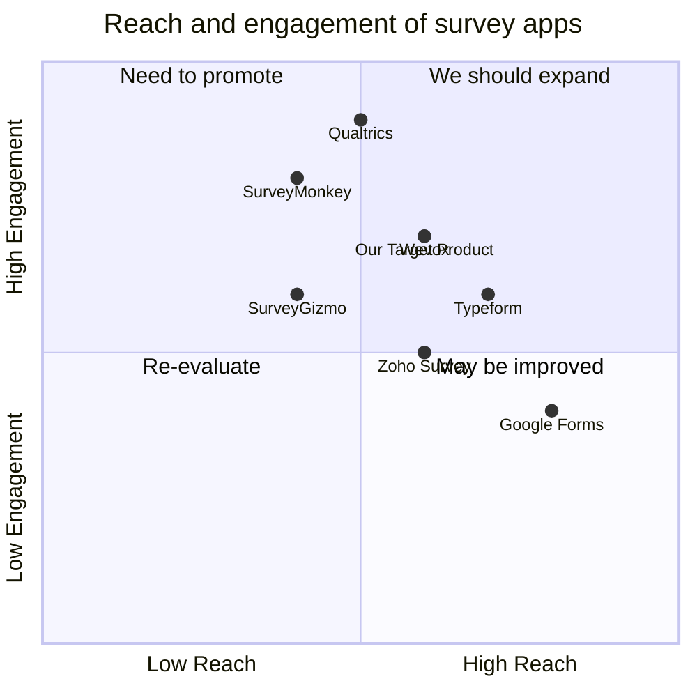

## Original Requirements:

The boss wants us to create an engagement survey app similar to Wevox. The front-end should be built using React and the backend should be built using Node.js.

## Product Goals:
```python
[
    "Create an engagement survey app",
    "Build the front-end using React",
    "Build the backend using Node.js"
]
```

## User Stories:
```python
[
    "As a user, I want to be able to create and manage surveys",
    "As a user, I want to be able to send surveys to participants",
    "As a user, I want to be able to collect and analyze survey responses",
    "As a user, I want to be able to generate reports based on survey data",
    "As a user, I want to be able to customize the survey design and branding"
]
```

## Competitive Analysis:
```python
[
    "Wevox: An engagement survey app with a user-friendly interface and robust analytics",
    "SurveyMonkey: A popular survey platform with a wide range of features",
    "Typeform: A survey tool known for its interactive and visually appealing surveys",
    "Google Forms: A simple and free survey tool provided by Google",
    "Qualtrics: An enterprise-level survey platform with advanced features",
    "Zoho Survey: A survey tool with a focus on collaboration and data analysis",
    "SurveyGizmo: A survey platform with advanced reporting and integration capabilities"
]
```

## Competitive Quadrant Chart:


## Requirement Analysis:
The product should be an engagement survey app that allows users to create and manage surveys, send surveys to participants, collect and analyze survey responses, generate reports, and customize the survey design and branding.

## Requirement Pool:
```python
[
    ("Users should be able to create and manage surveys", "P0"),
    ("Users should be able to send surveys to participants", "P0"),
    ("Users should be able to collect and analyze survey responses", "P0"),
    ("Users should be able to generate reports based on survey data", "P1"),
    ("Users should be able to customize the survey design and branding", "P1")
]
```

## UI Design draft:
The app should have a clean and intuitive user interface. It should include the following elements:

- Survey creation and management: Users should be able to create new surveys, edit existing surveys, and delete surveys.
- Participant management: Users should be able to add and remove participants for each survey.
- Survey sending: Users should be able to send surveys to participants via email or shareable links.
- Survey response collection: The app should collect and store survey responses from participants.
- Analytics and reporting: Users should be able to view and analyze survey responses, generate reports, and export data.
- Customization: Users should be able to customize the survey design, including colors, fonts, and branding elements.

The layout should be responsive and adapt to different screen sizes. The style should be modern and visually appealing.

## Anything UNCLEAR:
There are no unclear points.