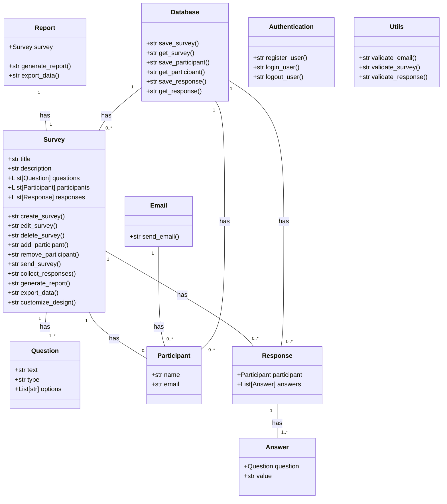
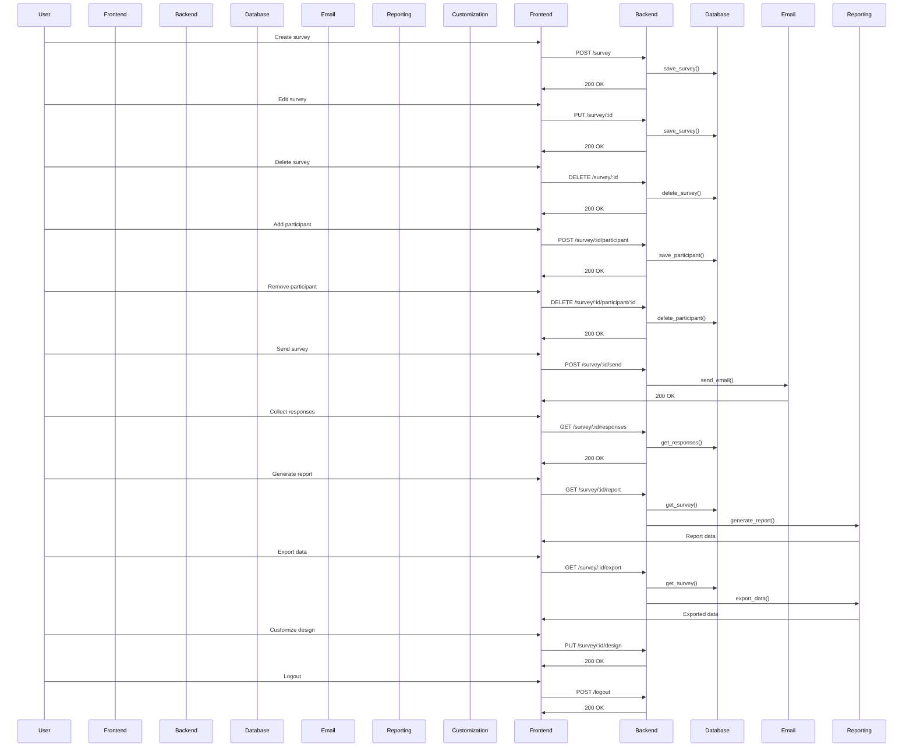

## Implementation approach:
For the front-end, I will use React to build a user-friendly and interactive interface. React is a popular open-source JavaScript library that provides a component-based approach to building user interfaces.

For the backend, I will use Node.js to handle server-side logic and API endpoints. Node.js is a runtime environment that allows us to run JavaScript on the server side, making it a suitable choice for building scalable and efficient web applications.

To store survey data and manage user authentication, I will use a database system. MongoDB is a popular open-source NoSQL database that provides flexibility and scalability for handling large amounts of data.

For sending emails, I will use the Nodemailer library, which is an open-source module for Node.js that allows us to send emails using SMTP or other transport methods.

For generating reports, I will use the pandas library, which is an open-source data analysis and manipulation library for Python. It provides powerful tools for data analysis and can be used to generate reports based on survey data.

For customizing the survey design and branding, I will use CSS frameworks such as Bootstrap or Material-UI. These frameworks provide pre-designed components and styles that can be easily customized to match the desired design and branding.

## Python package name:
```python
"engagement_survey"
```

## File list:
```python
[
    "main.py",
    "survey.py",
    "participant.py",
    "response.py",
    "report.py",
    "email.py",
    "database.py",
    "authentication.py",
    "utils.py"
]
```

## Data structures and interface definitions:


## Program call flow:


## Anything UNCLEAR:
There are no unclear points.