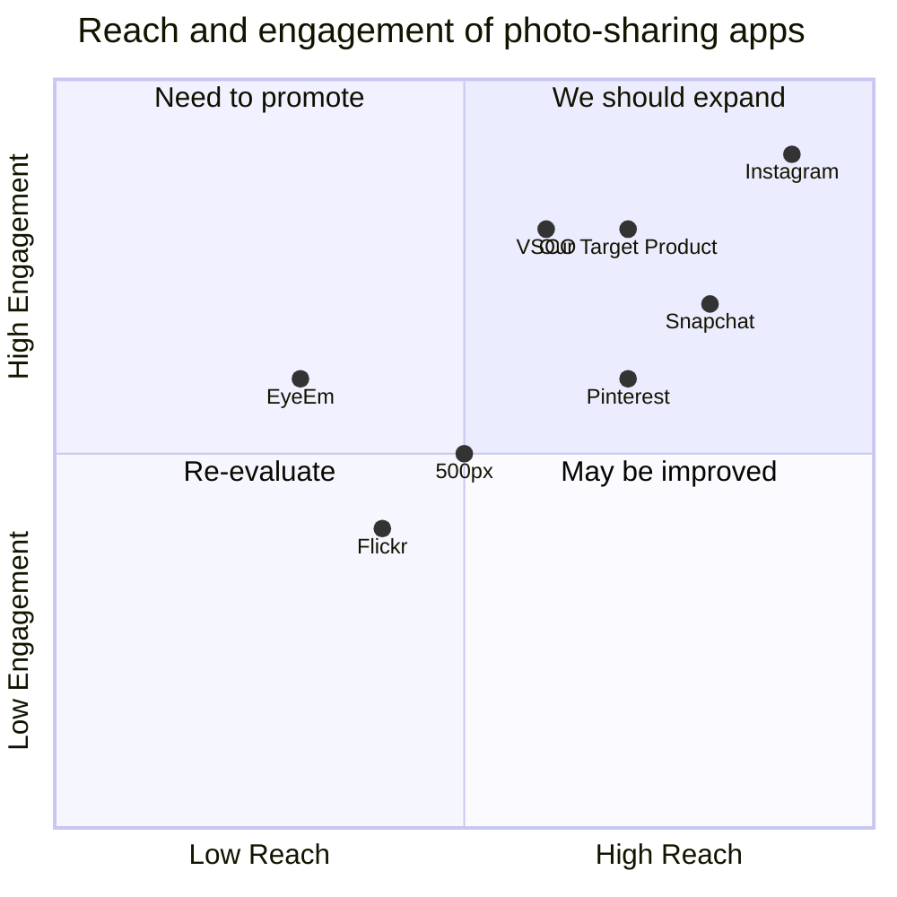

## Original Requirements
The boss wants us to create a React app similar to Instagram.

## Product Goals
```python
[
    "Create a user-friendly and visually appealing React app",
    "Provide features for users to upload and share photos",
    "Implement a social network aspect with the ability to follow other users and like/comment on their photos"
]
```

## User Stories
```python
[
    "As a user, I want to be able to create an account and log in to the app",
    "As a user, I want to be able to upload and share my photos with others",
    "As a user, I want to be able to follow other users and see their uploaded photos in my feed",
    "As a user, I want to be able to like and comment on photos",
    "As a user, I want to be able to discover new users and explore their photos"
]
```

## Competitive Analysis
```python
[
    "Instagram: A popular photo-sharing app with a large user base",
    "Snapchat: A multimedia messaging app known for its disappearing content",
    "Pinterest: A visual discovery and bookmarking tool for finding and saving creative ideas",
    "VSCO: A photo editing app with a strong community of photographers",
    "500px: A photography community for sharing and discovering high-quality photos",
    "Flickr: An online photo management and sharing platform",
    "EyeEm: A global community and marketplace for photography"
]
```

## Competitive Quadrant Chart


## Requirement Analysis
The product should be a user-friendly and visually appealing React app that allows users to upload and share photos. It should also have social networking features such as the ability to follow other users, like and comment on photos, and discover new users.

## Requirement Pool
```python
[
    ("User authentication: Implement a secure login and registration system", "P0"),
    ("Photo upload: Allow users to upload and share their photos", "P0"),
    ("Social network features: Implement the ability to follow other users, like and comment on photos", "P0"),
    ("Explore page: Create a page where users can discover new users and explore their photos", "P1"),
    ("Notifications: Notify users about new likes, comments, and followers", "P2")
]
```

## UI Design draft
The app will have a clean and modern design with a navigation bar at the top for easy access to different sections of the app. The home page will display a feed of photos from the users that the logged-in user follows. Each photo will have options to like and comment on it. Users will also have their own profile page where they can upload and manage their photos. The explore page will show recommended users and their photos. The design will use a combination of white and light gray backgrounds with colorful accents for buttons and icons.

## Anything UNCLEAR
There are no unclear points.