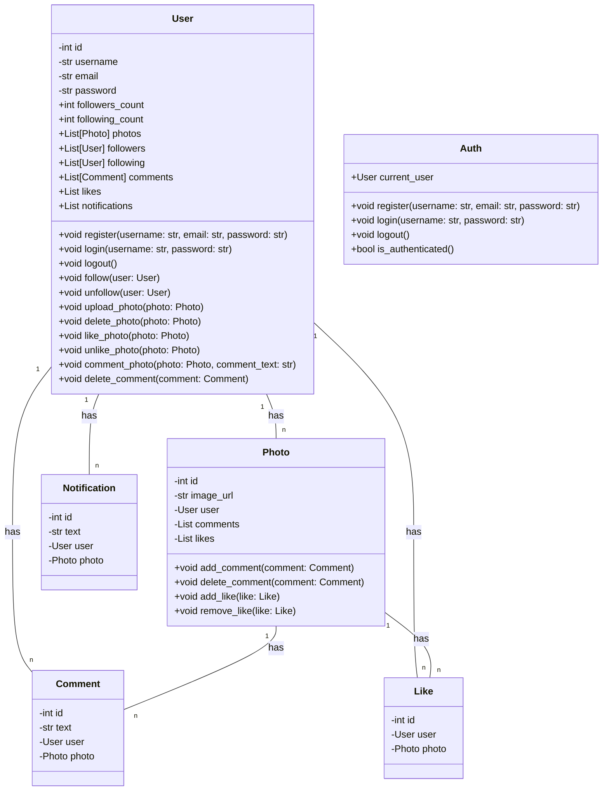
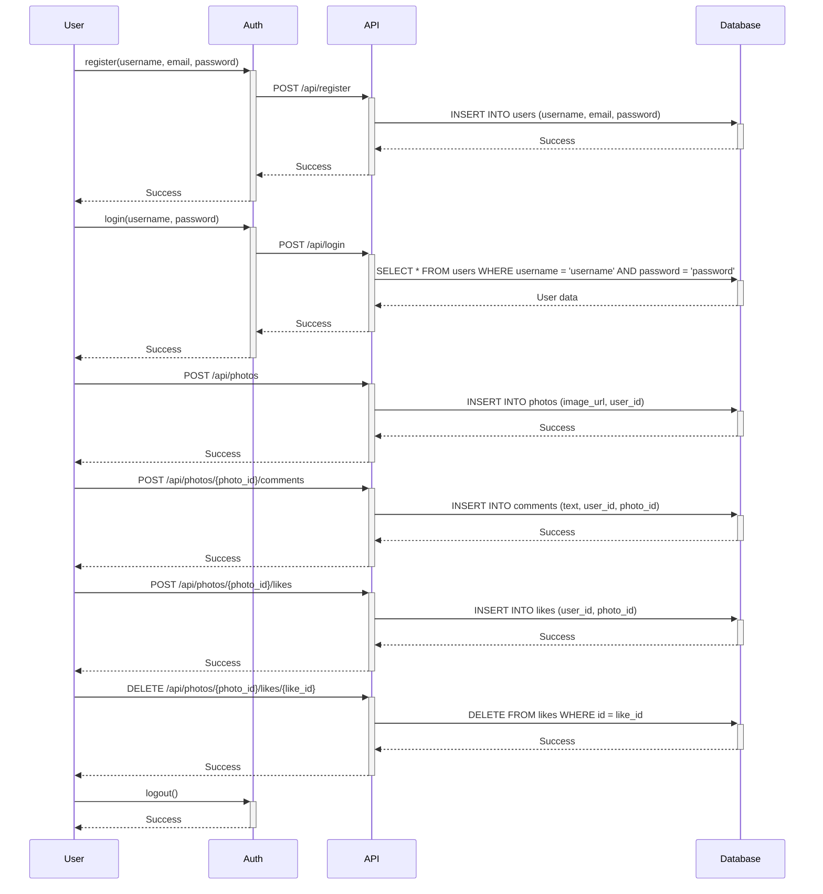

## Implementation approach
For this project, we will use the following open-source tools and frameworks:

- React: A popular JavaScript library for building user interfaces.
- Django: A high-level Python web framework that follows the model-view-controller (MVC) architectural pattern.
- Django REST framework: A powerful and flexible toolkit for building Web APIs.
- PostgreSQL: An open-source relational database management system.
- AWS S3: A cloud storage service for storing and retrieving user-uploaded photos.

We will use React for the frontend development, Django for the backend development, and PostgreSQL for the database. Django REST framework will be used to build the API endpoints for user authentication, photo upload, social network features, and notifications. AWS S3 will be used to store the user-uploaded photos.

## Python package name
```python
"instagram_clone"
```

## File list
```python
[
    "main.py",
    "models.py",
    "views.py",
    "serializers.py",
    "urls.py",
    "settings.py",
    "react_app/",
    "react_app/src/",
    "react_app/src/components/",
    "react_app/src/pages/",
    "react_app/src/services/",
    "react_app/src/utils/",
    "react_app/public/",
    "react_app/public/index.html",
    "react_app/public/favicon.ico",
    "react_app/public/manifest.json",
    "react_app/public/logo192.png",
    "react_app/public/logo512.png",
    "react_app/src/App.js",
    "react_app/src/index.js",
    "react_app/src/index.css",
    "react_app/src/components/Navbar.js",
    "react_app/src/components/Home.js",
    "react_app/src/components/Profile.js",
    "react_app/src/components/Explore.js",
    "react_app/src/components/Upload.js",
    "react_app/src/components/Notifications.js",
    "react_app/src/components/Photo.js",
    "react_app/src/pages/Login.js",
    "react_app/src/pages/Register.js",
    "react_app/src/services/api.js",
    "react_app/src/utils/auth.js",
    "react_app/src/utils/helpers.js"
]
```

## Data structures and interface definitions


## Program call flow


## Anything UNCLEAR
The requirements are clear to me.