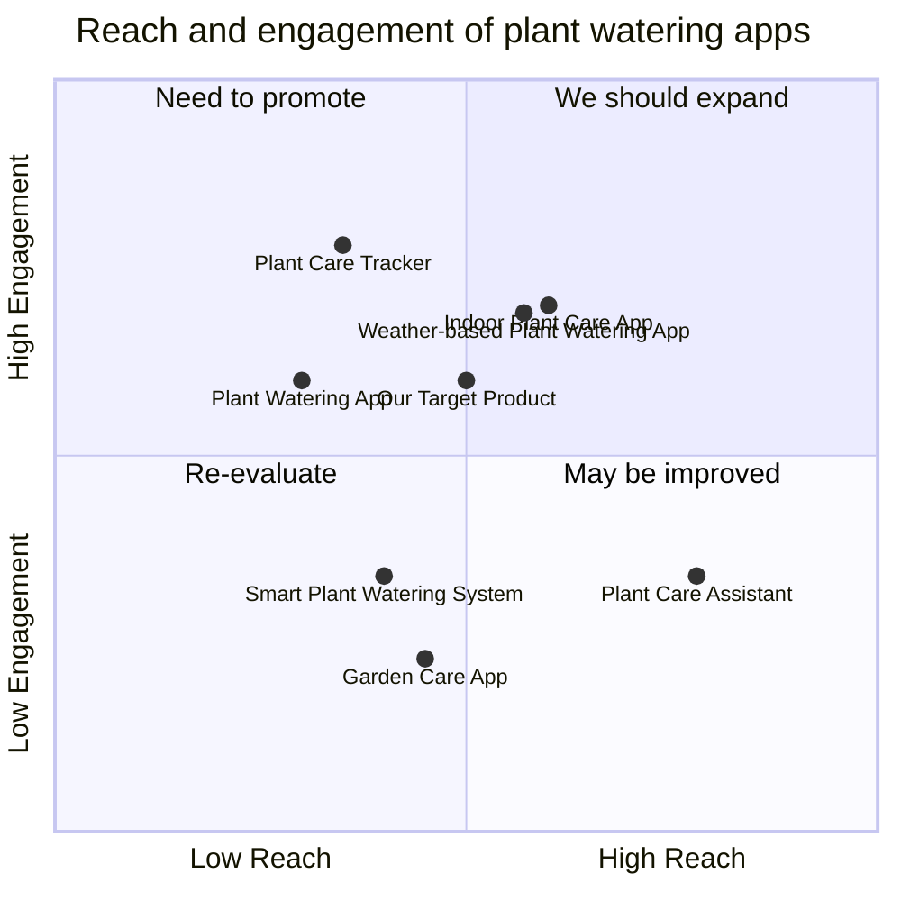

## Original Requirements:
The boss wants us to create an app for watering different types of plants according to the season and weather.

## Product Goals:
- Create a user-friendly app that allows users to easily water their plants based on the season and weather conditions.
- Provide accurate and timely information about the watering needs of different types of plants.
- Help users optimize their plant watering schedule to promote healthy plant growth.

## User Stories:
- As a user, I want to be able to input the types of plants I have so that the app can provide specific watering recommendations for each plant.
- As a user, I want the app to automatically adjust the watering schedule based on the current season and weather conditions.
- As a user, I want to receive notifications when it's time to water my plants or when there are changes in the weather that may affect the watering needs of my plants.
- As a user, I want the app to provide information about the optimal watering frequency and amount for each type of plant.
- As a user, I want the app to have a user-friendly interface that is easy to navigate and understand.

## Competitive Analysis:
- Plant Watering App: This app provides watering recommendations based on the type of plant and the current weather conditions. It also sends notifications to remind users when to water their plants.
- Garden Care App: This app offers a comprehensive set of features for plant care, including watering recommendations, fertilizing tips, and pest control advice.
- Weather-based Plant Watering App: This app uses real-time weather data to adjust the watering schedule for plants. It also provides information about the optimal watering conditions for different types of plants.
- Plant Care Assistant: This app provides personalized plant care advice based on the type of plant, location, and user preferences. It offers watering reminders and tracks the watering history of each plant.
- Smart Plant Watering System: This system includes sensors that monitor soil moisture levels and automatically water the plants when needed. It also provides a mobile app for users to monitor and control the watering schedule.
- Plant Care Tracker: This app allows users to keep track of their plant care activities, including watering, fertilizing, and pruning. It provides reminders and recommendations based on the specific needs of each plant.
- Indoor Plant Care App: This app focuses on providing care tips for indoor plants, including watering recommendations, light requirements, and temperature preferences.

## Competitive Quadrant Chart:


## Requirement Analysis:
The product should be a mobile app that provides watering recommendations for different types of plants based on the current season and weather conditions. It should have a user-friendly interface and send notifications to remind users when to water their plants. The app should also provide information about the optimal watering frequency and amount for each type of plant.

## Requirement Pool:
```python
[
    ("The app should allow users to input the types of plants they have.", "P0"),
    ("The app should automatically adjust the watering schedule based on the current season and weather conditions.", "P0"),
    ("The app should send notifications to remind users when to water their plants.", "P0"),
    ("The app should provide information about the optimal watering frequency and amount for each type of plant.", "P1"),
    ("The app should have a user-friendly interface that is easy to navigate and understand.", "P1")
]
```

## UI Design draft:
The app will have a simple and clean interface with the following elements:
- Home screen: This screen will display the user's plant collection and provide an overview of the watering schedule for each plant.
- Plant details screen: This screen will show detailed information about each plant, including the optimal watering frequency, amount, and season-specific watering tips.
- Notifications screen: This screen will display notifications about watering reminders and changes in weather conditions that may affect the watering needs of the plants.
- Settings screen: This screen will allow users to customize their preferences, such as notification settings and plant watering history.
The app will have a modern and intuitive design, with easy-to-understand icons and clear navigation menus.

## Anything UNCLEAR:
There are no unclear points.