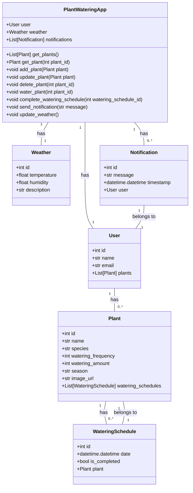
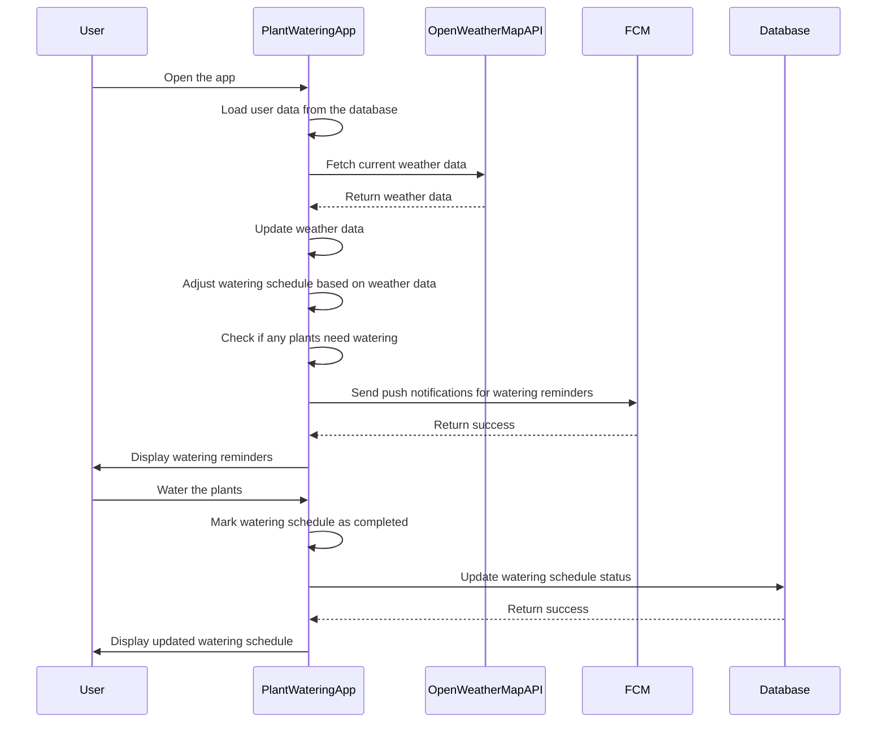

## Implementation approach:

To implement the plant watering app, we will use the following open-source tools:

1. Flask: Flask is a lightweight web framework that will allow us to build the backend of the app. We will use Flask to handle HTTP requests, route endpoints, and serve the frontend files.

2. SQLAlchemy: SQLAlchemy is an Object-Relational Mapping (ORM) library that will help us interact with the database. We will use SQLAlchemy to define the plant and user models, create database tables, and perform CRUD operations.

3. OpenWeatherMap API: We will use the OpenWeatherMap API to fetch real-time weather data. This will allow us to adjust the watering schedule based on the current weather conditions.

4. Firebase Cloud Messaging (FCM): FCM is a cross-platform messaging solution that will enable us to send push notifications to the users' devices. We will use FCM to send notifications when it's time to water the plants or when there are changes in the weather.

5. Bootstrap: Bootstrap is a popular CSS framework that will help us create a responsive and user-friendly frontend. We will use Bootstrap to style the app and make it look visually appealing.

## Python package name:
```python
"plant_watering_app"
```

## File list:
```python
[
    "main.py",
    "models.py",
    "routes.py",
    "templates/index.html",
    "templates/plant_details.html",
    "templates/notifications.html",
    "templates/settings.html",
    "static/css/styles.css",
    "static/js/main.js"
]
```

## Data structures and interface definitions:


## Program call flow:


## Anything UNCLEAR:
The requirements are clear to me.