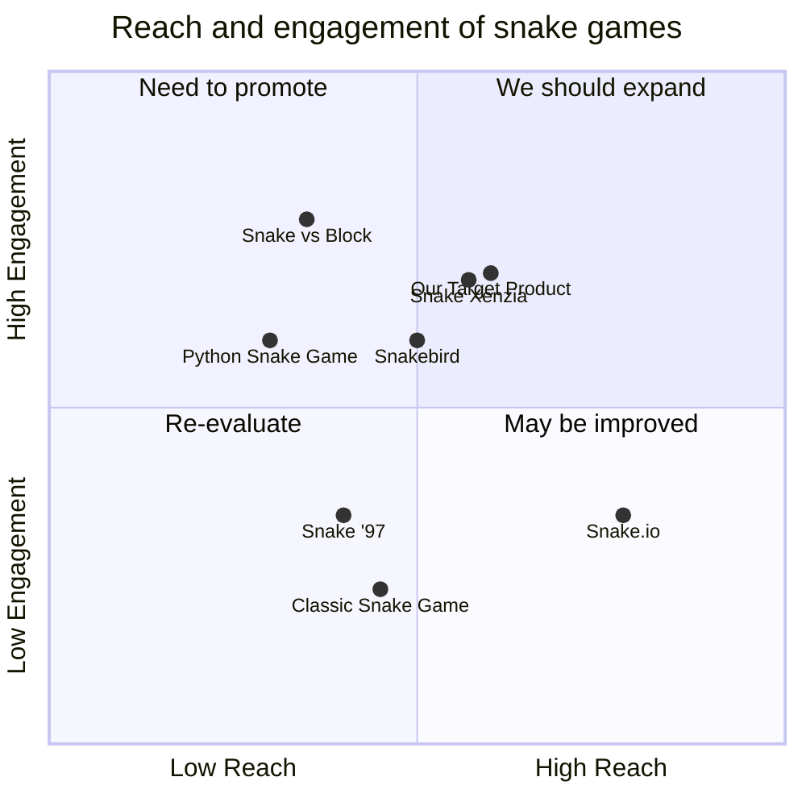

## Original Requirements:

The boss wants a command-line snake game.

## Product Goals:
```python
[
    "Create a command-line snake game",
    "Provide an enjoyable gaming experience",
    "Ensure smooth and responsive controls"
]
```

## User Stories:
```python
[
    "As a player, I want to control the snake using arrow keys",
    "As a player, I want the snake to grow longer when it eats food",
    "As a player, I want the game to end if the snake hits the wall or itself",
    "As a player, I want to see my current score during the game",
    "As a player, I want to be able to restart the game after it ends"
]
```

## Competitive Analysis:
```python
[
    "Python Snake Game: A simple snake game implemented in Python with basic features",
    "Classic Snake Game: A popular snake game with various levels and power-ups",
    "Snake Xenzia: A classic snake game with retro graphics and challenging levels",
    "Snake.io: A multiplayer snake game where you compete against other players",
    "Snake '97: A nostalgic snake game with a retro interface",
    "Snake vs Block: A unique snake game where you break blocks to progress",
    "Snakebird: A puzzle game with snake-like mechanics and challenging levels"
]
```

## Competitive Quadrant Chart:


## Requirement Analysis:
The product should be a command-line snake game with smooth controls, a growing snake, and game over conditions when hitting the wall or itself. The game should display the current score and allow the player to restart after the game ends.

## Requirement Pool:
```python
[
    ("End game conditions: The game should end if the snake hits the wall or itself", "P0"),
    ("Score display: The game should show the player's current score during gameplay", "P1"),
    ("Restart functionality: The player should be able to restart the game after it ends", "P1")
]
```

## UI Design draft:
The game will be displayed in the command-line interface. The snake will be represented by a series of characters, such as "O", and the food will be represented by a different character, such as "*". The player will control the snake using arrow keys. The score will be displayed at the top of the screen. The game over screen will show the final score and provide an option to restart the game.

## Anything UNCLEAR:
There are no unclear points.