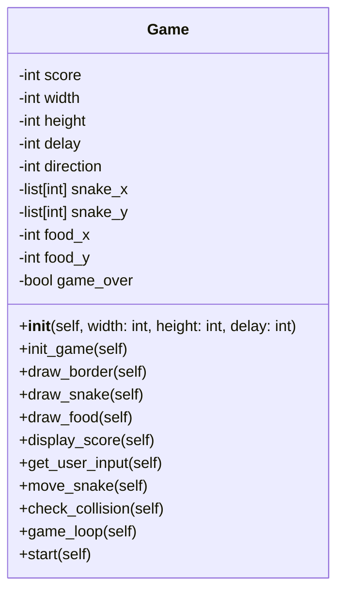
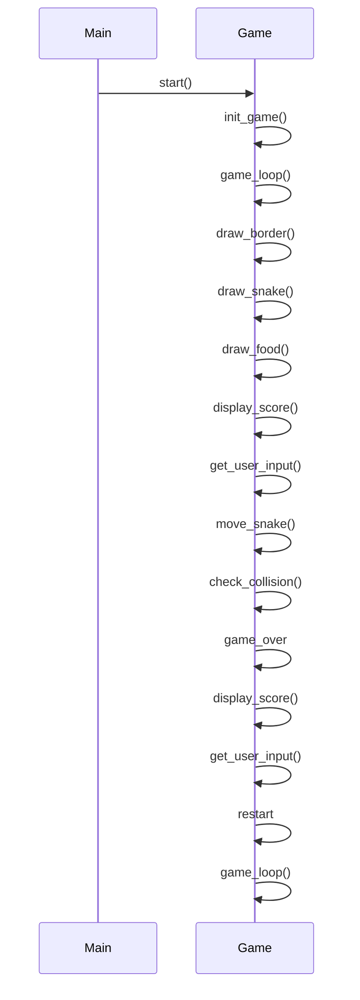

## Implementation approach:
For the implementation of the command-line snake game, we will use the following open-source tools:

1. `curses` library: This library provides a terminal-independent way of creating text-based interfaces. It will be used to handle keyboard input and display the game screen.

2. `random` module: This module will be used to generate random positions for the food item in the game.

3. `time` module: This module will be used to control the speed of the game by introducing delays between each frame.

## Python package name:
```python
"snake_game"
```

## File list:
```python
[
    "main.py",
]
```

## Data structures and interface definitions:


## Program call flow:


## Anything UNCLEAR:
The requirements are clear and there are no unclear points.