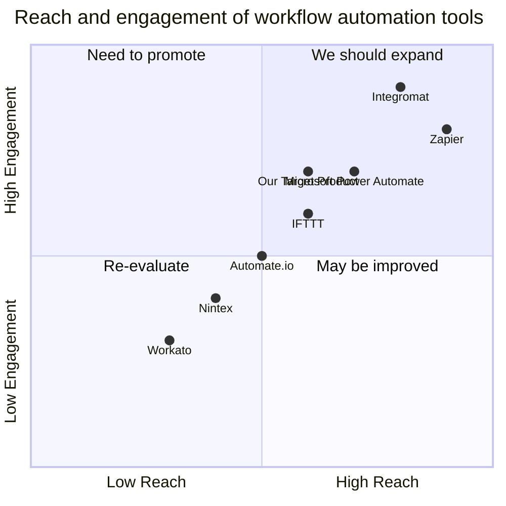

## Original Requirements:
The boss wants to create a workflow service similar to Integromat.

## Product Goals:
```python
[
    "Create a workflow service that allows users to automate tasks and integrate different apps",
    "Provide a user-friendly interface for creating and managing workflows",
    "Ensure high reliability and performance of the service"
]
```

## User Stories:
```python
[
    "As a user, I want to be able to connect different apps and automate tasks easily",
    "As a user, I want to create complex workflows with conditional logic and data transformations",
    "As a user, I want to be able to monitor and debug my workflows to ensure they are running correctly",
    "As a user, I want to be able to schedule workflows to run at specific times or intervals",
    "As a user, I want to be able to integrate with external APIs and services"
]
```

## Competitive Analysis:
```python
[
    "Integromat: A popular workflow automation tool with a wide range of integrations",
    "Zapier: Another popular workflow automation tool with a focus on business automation",
    "Microsoft Power Automate: A workflow automation tool integrated with Microsoft products",
    "IFTTT: A simple workflow automation tool for personal use",
    "Automate.io: A workflow automation tool with a focus on marketing and sales automation",
    "Nintex: A workflow automation tool for enterprise-level automation",
    "Workato: A workflow automation tool with a focus on enterprise integration"
]
```

## Competitive Quadrant Chart:


## Requirement Analysis:
The product should be a workflow service that allows users to automate tasks and integrate different apps. It should provide a user-friendly interface for creating and managing workflows. The service should ensure high reliability and performance.

## Requirement Pool:
```python
[
    ("Support a wide range of app integrations", "P0"),
    ("Allow users to create complex workflows with conditional logic and data transformations", "P0"),
    ("Provide monitoring and debugging features for workflows", "P1"),
    ("Allow users to schedule workflows to run at specific times or intervals", "P1"),
    ("Integrate with external APIs and services", "P2")
]
```

## UI Design draft:
The UI should have a clean and intuitive design. It should include the following elements:
- Dashboard: A centralized view of all the user's workflows and their status.
- Workflow Editor: A drag-and-drop interface for creating and editing workflows. Users should be able to connect different apps, add conditional logic, and perform data transformations.
- Monitoring and Debugging Panel: A panel that shows the status of running workflows and allows users to debug any issues.
- Scheduler: A feature that allows users to schedule workflows to run at specific times or intervals.
- Integration Manager: A section where users can manage their integrations with external APIs and services.

The UI should have a modern and responsive design, with a clean color scheme and clear typography. The layout should be organized and intuitive, with easy navigation between different sections.

## Anything UNCLEAR:
There are no unclear points.