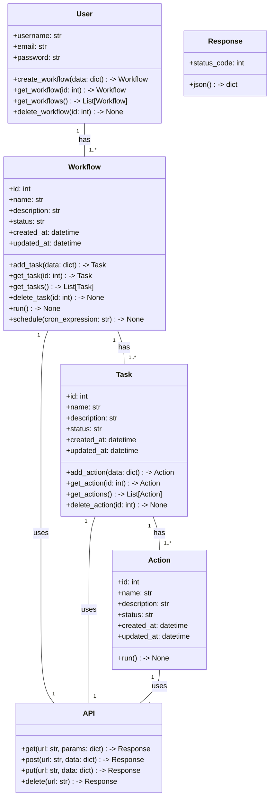
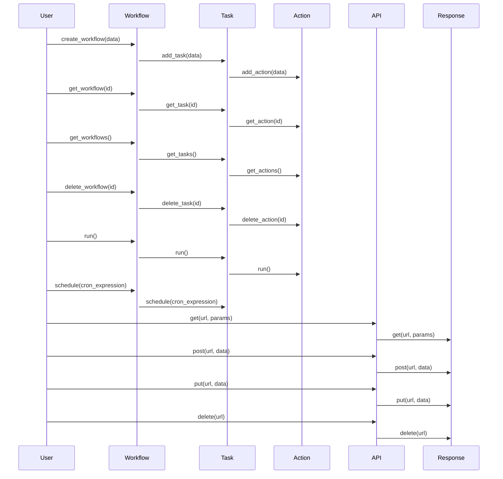

## Implementation approach:
To implement the workflow service, we will use the Django web framework, which is a high-level Python web framework that follows the Model-View-Controller (MVC) architectural pattern. Django provides a robust set of tools and libraries for building web applications, including user authentication, database management, and template rendering.

For the user interface, we will use React, a popular JavaScript library for building user interfaces. React provides a component-based architecture that allows for reusable and modular UI components. We will use the Django REST framework to create a RESTful API that communicates with the React frontend.

To integrate different apps and services, we will use the Celery distributed task queue, which allows us to run tasks asynchronously and distribute them across multiple workers. Celery supports various message brokers, such as RabbitMQ and Redis, which can be used to handle task queues.

For monitoring and debugging, we will use the Django Debug Toolbar, a configurable set of panels that display various debug information about the current request/response. This will help users identify and fix any issues with their workflows.

To schedule workflows to run at specific times or intervals, we will use the Celery Beat scheduler, which is an extension of Celery that adds support for periodic tasks. Celery Beat allows users to define a schedule for their workflows and automatically run them at the specified times.

For integrating with external APIs and services, we will use the Requests library, which is a simple and elegant HTTP library for Python. Requests provides a high-level interface for sending HTTP requests and handling responses.

## Python package name:
```python
"workflow_service"
```

## File list:
```python
[
    "main.py",
    "models.py",
    "views.py",
    "serializers.py",
    "urls.py",
    "tasks.py",
    "celery.py",
    "settings.py",
    "requirements.txt"
]
```

## Data structures and interface definitions:


## Program call flow:


## Anything UNCLEAR:
The requirements are clear to me.